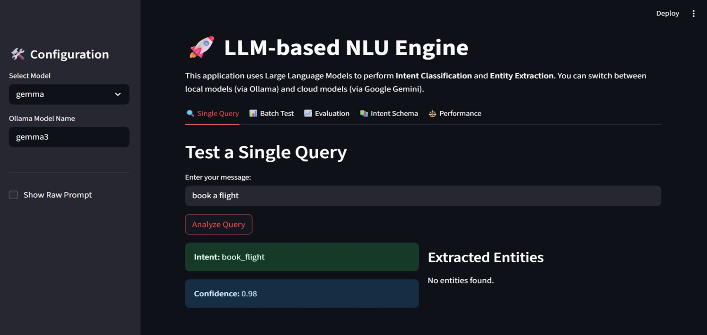
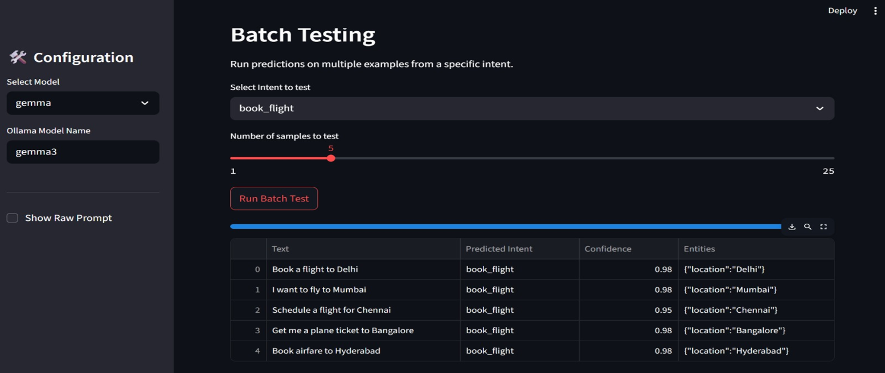
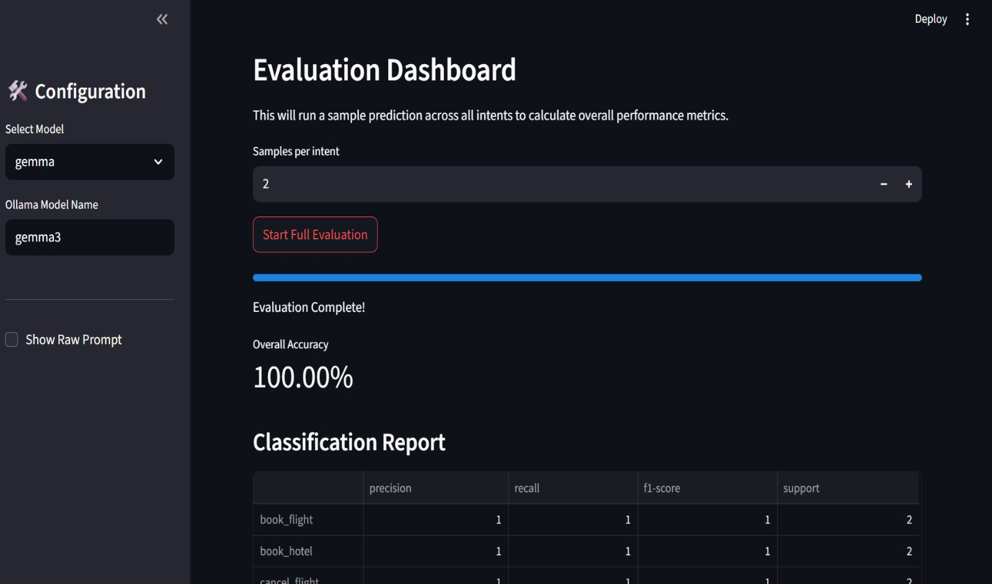
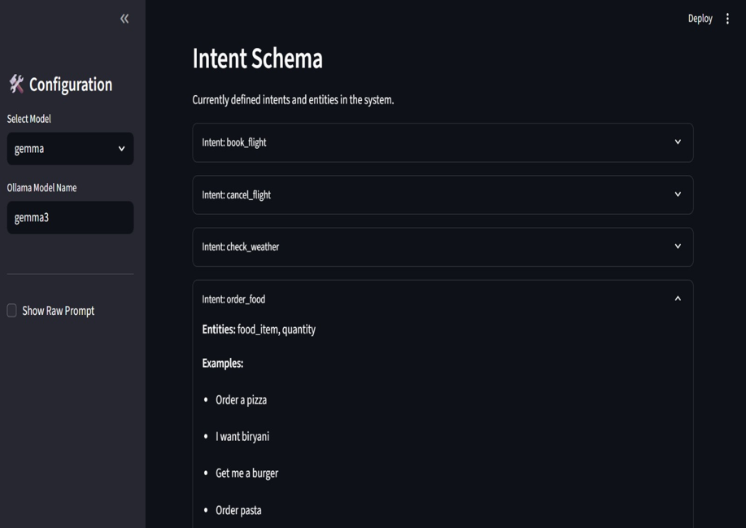
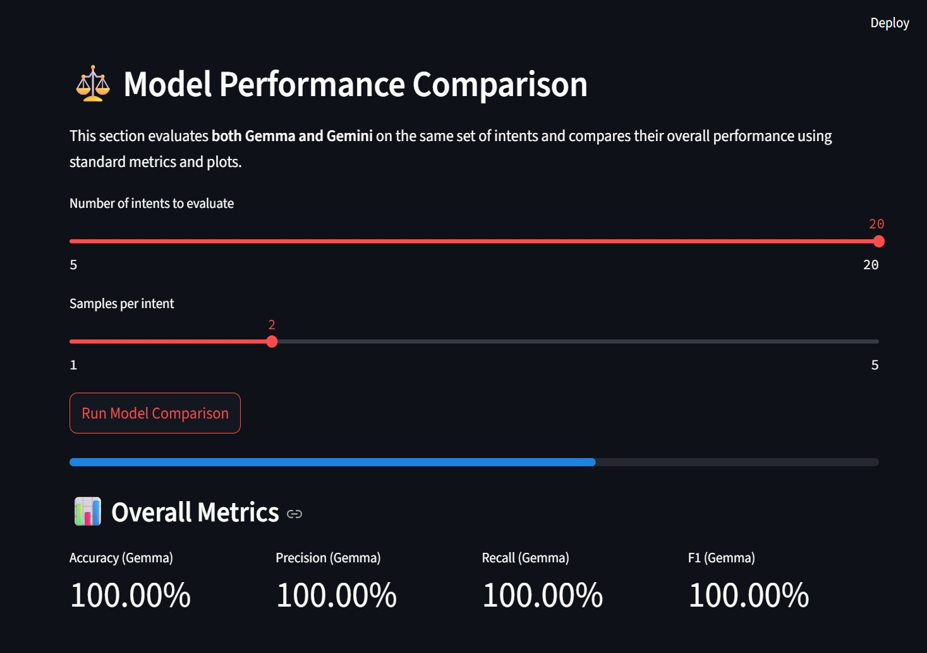

# TeamB_Final_Project
# 🤖 BotTrainer – LLM-Based NLU Model Trainer & Evaluator

BotTrainer is an **end-to-end LLM-powered Natural Language Understanding (NLU) platform** designed for **intent classification and entity extraction** using **prompt engineering** instead of traditional machine learning classifiers.

The system follows a **JSON-first schema design**, supports **multiple LLM backends** (local **Gemma-3 via Ollama** and **Google Gemini API**), and provides **real-time inference, batch testing, evaluation, and model comparison** through an interactive **Streamlit UI**.

---

## 🚀 Key Highlights

- 🔹 Prompt-based NLU (no classical ML intent classifiers)
- 🔹 JSON-driven intent & entity schema
- 🔹 Schema-guided prompting to reduce hallucination
- 🔹 Multi-LLM support (Gemma-3 & Gemini)
- 🔹 Model comparison with standard evaluation metrics
- 🔹 Batch testing & dataset analytics
- 🔹 Modular, production-style project structure
- 🔹 Interactive Streamlit dashboard

---

## 🎯 Project Objectives

- Replace traditional intent classifiers with **LLM-based prompt inference**
- Perform **intent detection and entity extraction in a single pass**
- Enforce **structured JSON outputs** from LLMs
- Compare **multiple LLMs** under the same evaluation setup
- Evaluate performance using Accuracy, Precision, Recall, and F1-score
- Provide an intuitive UI for testing, evaluation, and analysis

---

## 🧠 High-Level Architecture

User Input  
→ Prompt Template + Intent & Entity Schema  
→ LLM Inference (Gemma-3 / Gemini)  
→ Structured JSON Output  
→ Parsing & Validation  
→ Evaluation, Comparison & Visualization (Streamlit)

---

## 📦 Dataset Design

### 🔹 Primary Dataset – `intents.json`

A JSON-first schema defining intents, examples, and entities.

✔ Injected directly into prompts  
✔ Prevents hallucination  
✔ Easily extensible  

---

### 🔹 Evaluation Dataset – `full_nlu_dataset_325.csv`

Flattened dataset used for evaluation and analytics.

| Column | Description |
|------|------------|
| text | User utterance |
| true_intent | Ground truth intent |

---

## 🖥️ User Interface (Streamlit)

### 🔹 Single Query NLU Tester


### 🔹 Batch Testing


### 🔹 Evaluation Dashboard


### 🔹 Intent Schema Explorer


### 🔹 Model Performance Comparison


---

## ⚖️ Model Comparison Strategy

Both models are evaluated using:
- Same intent set
- Same samples per intent
- Same prompt template
- Same evaluation metrics

Ensures fair and unbiased comparison.

---

## ⚙️ Setup & Execution

```bash
pip install -r requirements.txt
ollama pull gemma3
export GOOGLE_API_KEY="your_api_key_here"
streamlit run app.py
```

---

## 🌱 Future Enhancements

- Entity-level evaluation
- Prompt debugging UI
- Multi-language support
- Multi-turn conversations
- Docker & cloud deployment

---

## 👨‍💻 Team

Jeeva M, Nishtha Mishra, Swayam Bora, Riya, Siri Reddy, Srinivas, Utkarsh Gupta

---

## ✅ Conclusion

BotTrainer demonstrates that **schema-guided prompt engineering with LLMs** can reliably replace traditional NLU pipelines while remaining scalable, explainable, and model-agnostic.
