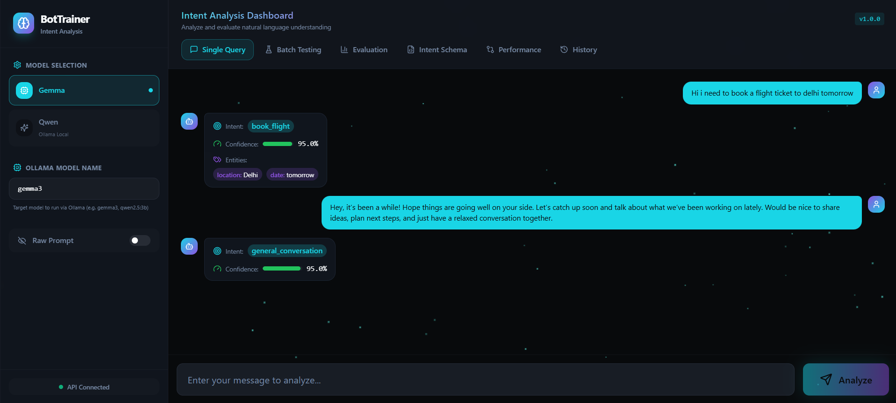
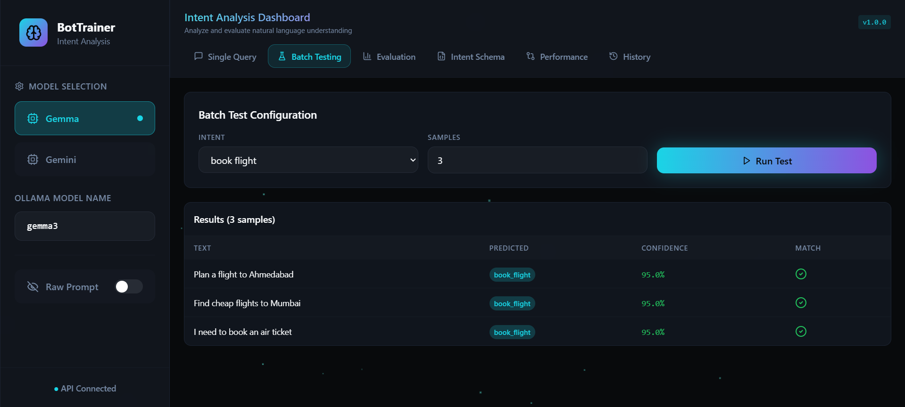
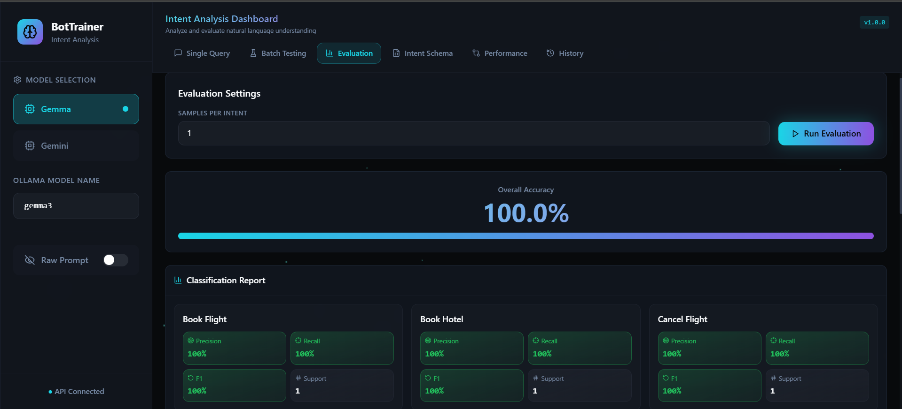
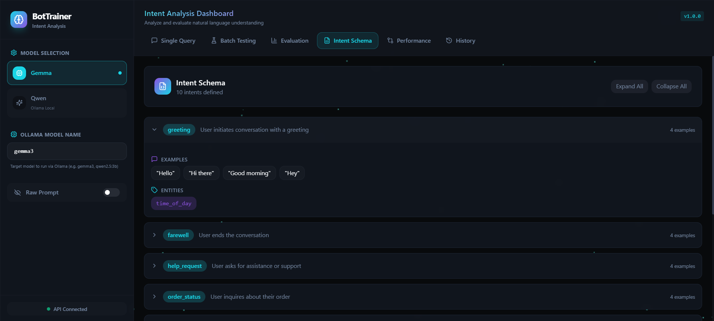
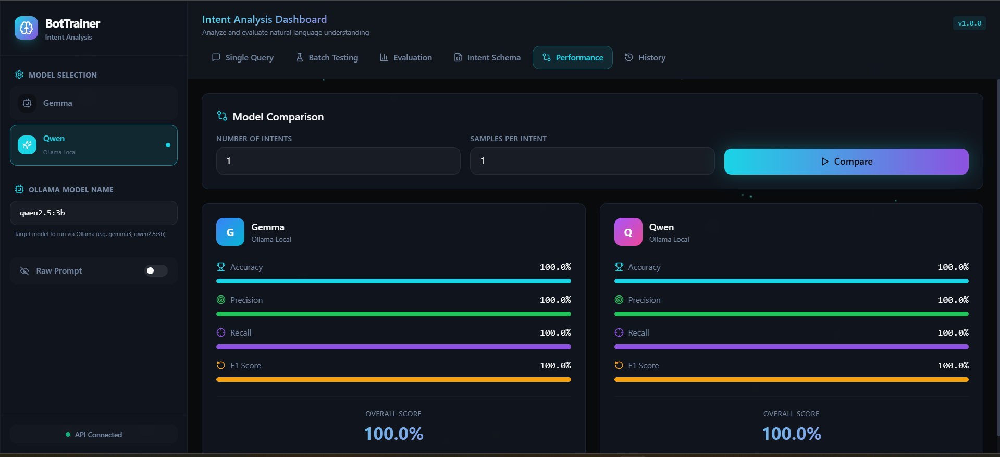
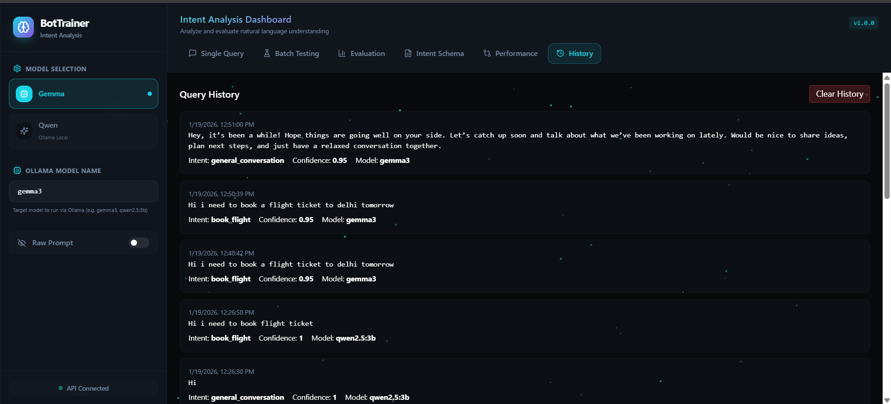

# 🤖 BotTrainer – LLM-Based NLU Model Trainer & Evaluator

BotTrainer is an **end-to-end LLM-powered Natural Language Understanding (NLU) platform** designed for **intent classification and entity extraction** using **prompt engineering** instead of traditional machine learning classifiers.

The system follows a **JSON-first schema design**, supports **multiple local LLM backends** (such as **Gemma-3** and **Qwen 2.5 via Ollama**), and provides **real-time inference, batch testing, evaluation, and model comparison** through a modern **React-based UI**.

---

## 🚀 Key Highlights

- 🔹 Prompt-based NLU (no classical ML intent classifiers)
- 🔹 JSON-driven intent & entity schema
- 🔹 Schema-guided prompting to reduce hallucination
- 🔹 Multi-LLM support (Gemma-3 & Qwen 2.5)
- 🔹 Fair model comparison with standard evaluation metrics
- 🔹 Batch testing & dataset analytics
- 🔹 Modular, production-style backend architecture
- 🔹 Modern React UI for interactive analysis

---

## 🎯 Project Objectives

- Replace traditional intent classifiers with **LLM-based prompt inference**
- Perform **intent detection and entity extraction in a single pass**
- Enforce **structured JSON outputs** from LLMs
- Compare **multiple LLMs** under the same evaluation setup
- Evaluate performance using Accuracy, Precision, Recall, and F1-score
- Provide an intuitive UI for testing, evaluation, and analysis

---

## 🧠 High-Level Architecture

User Input  
→ Prompt Template + Intent & Entity Schema  
→ LLM Inference (Gemma-3 / Qwen 2.5 via Ollama)  
→ Structured JSON Output  
→ Parsing & Validation  
→ Evaluation, Comparison & Visualization (React UI)

---

## 📦 Dataset Design

### 🔹 Primary Dataset – `intents.json`

A JSON-first schema defining intents, examples, and entities.

✔ Injected directly into prompts  
✔ Prevents hallucination  
✔ Easily extensible  

---

### 🔹 Evaluation Dataset – `full_nlu_dataset_325.csv`

Flattened dataset used for evaluation and analytics.

| Column | Description |
|------|------------|
| text | User utterance |
| true_intent | Ground truth intent |

---

## 🖥️ User Interface (React)

### 🔹 Single Query NLU Tester


### 🔹 Batch Testing


### 🔹 Evaluation Dashboard


### 🔹 Intent Schema Explorer


### 🔹 Model Performance Comparison


### 🔹 Query History & Logs


---

## ⚖️ Model Comparison Strategy

Both models are evaluated using:
- Same intent set
- Same samples per intent
- Same prompt template
- Same evaluation metrics

This ensures a **fair, unbiased, and reproducible comparison** between LLMs.

---

## ⚙️ Setup & Execution

```bash
pip install -r requirements.txt
ollama pull gemma3
ollama pull qwen2.5:3b
npm install
npm run dev
python server.py
```

---

## 🌱 Future Enhancements

- Entity-level evaluation metrics
- Prompt debugging & inspection UI
- Multi-language intent detection
- Multi-turn, context-aware conversations
- Docker & cloud deployment
- Voice input integration

---

## 👨‍💻 Team

Jeeva M, Nishtha Mishra, Swayam Bora, Riya, Siri Reddy, Srinivas, Utkarsh Gupta

---

## ✅ Conclusion

BotTrainer demonstrates that **schema-guided prompt engineering with LLMs** can reliably replace traditional NLU pipelines while remaining scalable, explainable, and model-agnostic. 
The combination of **local LLMs, structured prompts, rigorous evaluation, and a modern UI** makes BotTrainer a strong foundation for next-generation chatbot intelligence.
